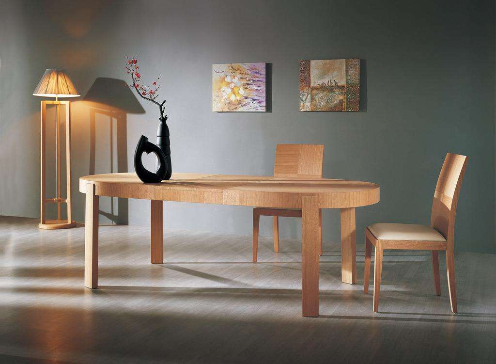

对自己好一点，因为这一辈子很短暂。
<!-- more -->
对自己好一点，因为这一辈子很短暂。
这句话很多人都知道，听人讲过，也理解其中的意思，可是却没有多少人在意。对自己好一点，不仅是身体上还有感情上、生活上、事业上。
 
## 首先，从身体来讲，对自己好一点非常必要。 

俗话说，好身体是革命的本钱。只有拥有一个健康强壮的体格，我们才有努力实现梦想的资本。人的身体其实没有我们想象的那样“刀枪不入”，很多时候，一个感冒就能让我们卧床不起。
对自己好一点，经常进行体育锻炼，多抽出时间照顾自己的身体，按时吃药，吃一些有益身体健康的食物，少吃快餐，多吃有营养的食物。
农村人在这一点上尤为突出，年轻的时候敢拼敢干，不怕苦不怕累，风雨兼程，卖下了病根。等到老了，发现一身的病，随便一个感冒就得住院好几天。
对自己好一点，赚钱虽然很重要，保重身体尤为重要。钱没有可以赚，身体垮了就难治好了。钱够用就好，挣那么多钱，最后又带不走，还不是一堆废纸。

## 第二，在感情上对自己好一点。

有句话说的好：“我们都对至亲至爱的人太苛刻，对陌生人太友善。”人这一生，至亲至爱的人应该是自己，自己永远不会存在背叛，不会欺骗。
对自己好点，我们知道在这个世界上，有很多人对伴侣非常好，甚至不惜出卖自己的一切来满足对方，这就是典型的好男人或是好女人。
然而，我们比对一对对这样的伴侣，往往结局非常凄惨，好男人往往头顶一片绿；好女人往往一次次被玩弄。
对自己好一点，不要违心的去做事，总是委屈自己去满足他人，结果反而让对方得寸进尺，理所当然。
找一个适合自己的伴侣，这个人可以不帅，可以不漂亮，但是一定要懂，要信任，要理解。
感情不是勉强能够换来的，任何一段幸福的爱情不是一开始不合最后很幸福，这样的桥段只有电影导演瞎编，这个世界上，任何一个角落绝不存在这样的画面。
不要妄想去改变一个人，不够成熟可以慢慢长大，性格不合很难改变，不适合的就不要勉强，总有一个人适合自己，大胆的放手去寻找那个真正能给你幸福的他。

## 第三，生活上对自己好一点。

 
不要总是忙于工作，忙于事业。多抽出时间做自己喜欢做的事情，不要夜以继日的工作，谁都不是机器人，总有累垮的时候。猝死在工作台的事情不是没有过，曾经开网店猝死在电脑前的有很多。
有钱没钱，吃喝好一点。不要求有多贵，但一定要健康，绿色，营养搭配得当，不要舍不得花钱买吃的，吃好了是对自己身体好。赚那么多钱流着干啥，抽那么多烟，喝那么多酒，最后还不是花钱买罪受。
自己喜欢什么样的穿着，就尽情的去买，去打扮，人的一生不全是为自己而活，但一定要活的洒脱。

## 第四，事业上对自己好一点。

 
事业是人一辈子的依赖，没有事业，就没有钱，没有钱我们就不能做很多事，所以，事业非常重要。选择一个适合自己的事业，这个事业不一定能赚多少钱，但一定要适合自己。
我说过，钱，够用就行，赚那么多钱干嘛，最后还不是带不走，等同一堆废纸。世界首富比尔盖茨赚那么多钱，最后还不是全部捐给慈善事业。
在这个地球上，绝大部分人是给别人打工的，对自己好一点，工作不顺心就不要勉强，不要总安慰自己：“这一切会好的。”什么时候才会好？
谁都说不准，天涯何处无芳草，不要在一棵树上吊死。这个工作不好，还有下一个工作等着你。
 
最后，对自己好一点，不以物喜，不以己悲。不要因为别人拥有而妒忌，也不要因为自己的缺点而自卑，人不能活在别人的世界，要活出自我。时刻告诉自己，走自己的路，让别人去说吧。
对自己好一点，这一辈子很短暂，有些事现在不去做，也许一辈子也不会去做了。