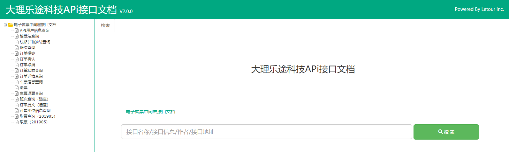
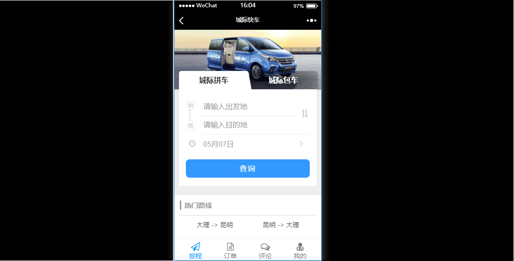
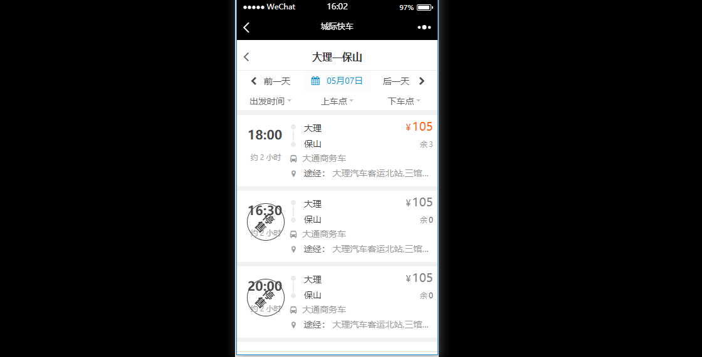

title: 作品一览
date: 2017-12-04 15:24:24
fancybox: false
---

## [2019]客票网售权限管理系统
	客票网售权限管理系统是用于归并不同票源数据的中间系统，能够开放给各大电子客票销售渠道并且使用权限控制手段让各个渠道拥有定制化的销售数据。

<!-- more -->
## [2019]云师傅司机端APP
	云师傅司机端是一款方便网约车司机联系乘客乘车，接收乘客订单的APP；使用H5+APP技术，接口连接服务端数据。

<!-- more -->
## [2019]城际快车
	城际快车是一款基于H5开发的微信站点，消费者可使用他购买网约车车票。使用方式：[微信打开网址 http://car.yn12328.com/]

<!-- more -->
